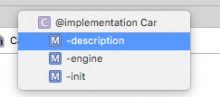

title: XCode Manual
categories:
  - iOS
tags:
  - iOS
  - XCode
date: 2016-01-26 14:11:51
---
XCode工具的日常操作、错误提示及修正方式。

## XCode
### 1. 常用操作

1. command ＋ 0  关闭左侧项目浏览
2. command ＋ [ 或 ] 添加／删除tab
3. tab 补全代码
4. Esc 显示代码提示菜单
5. 头文件/.m文件中选中类名， Edit --> Rename 重命名类名
6. 双击变量名，点击右侧Edit all in scope，重命名变量名
7. 功能菜单    
	#pragma mark whatever balabalabal
	
	#progma mark - 分割线

8. command + 点击功能菜单的函数名，会排序显示 
	

9. option + 点击代码，调出 Documentation and api reference（Help中也可打开）

### 2. Debug操作

* GDB 属GNU
* LLDB 属LLVM

